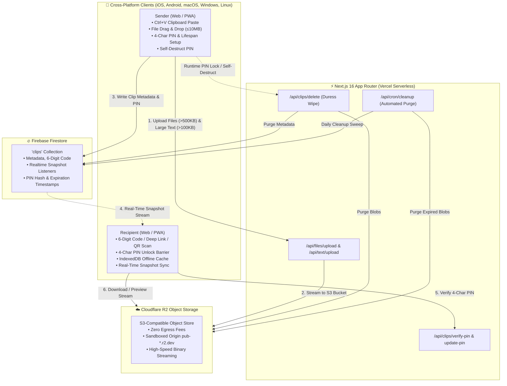

<p align="center">
  <a href="https://pasteport.zain-imran.com">
    
  </a>
</p>

<h1 align="center">Pasteport — Cross-Device Sharing + Developer Toolkit</h1>

<p align="center">
  <strong>Cross-device clipboard sharing paired with 18 client-side developer workflow utilities.</strong><br/>
  <em>Instant 6-digit codes, QR camera scanning, offline downloads, and zero server transmission. 100% open-source, privacy-first, and self-hostable.</em>
</p>

<p align="center">
  <a href="https://pasteport.zain-imran.com"><strong>🚀 Live Demo</strong></a> •
  <a href="https://pasteport.zain-imran.com/tools"><strong>🛠️ Dev Toolkit Hub (18 Tools)</strong></a> •
  <a href="https://vercel.com/new/clone?repository-url=https%3A%2F%2Fgithub.com%2FzainImran864%2Fonline_clipboard&env=NEXT_PUBLIC_FIREBASE_API_KEY,NEXT_PUBLIC_FIREBASE_AUTH_DOMAIN,NEXT_PUBLIC_FIREBASE_PROJECT_ID,NEXT_PUBLIC_FIREBASE_STORAGE_BUCKET,NEXT_PUBLIC_FIREBASE_MESSAGING_SENDER_ID,NEXT_PUBLIC_FIREBASE_APP_ID,CLOUDFLARE_ACCOUNT_ID,R2_ACCESS_KEY_ID,R2_SECRET_ACCESS_KEY,R2_BUCKET_NAME,R2_PUBLIC_URL,CRON_SECRET&project-name=pasteport&repository-name=pasteport"><strong>⚡ Deploy to Vercel</strong></a> •
  <a href="#why-pasteport"><strong>✨ Why Pasteport?</strong></a> •
  <a href="#developer-toolkit-suite"><strong>🧰 Developer Toolkit</strong></a> •
  <a href="#getting-started"><strong>🛠️ Quickstart</strong></a> •
  <a href="CONTRIBUTING.md"><strong>🤝 Contributing</strong></a>
</p>

<p align="center">
  <a href="LICENSE"></a>
  <a href="https://nextjs.org/"></a>
  <a href="https://react.dev/"></a>
  <a href="https://www.typescriptlang.org/"></a>
  <a href="https://tailwindcss.com/"></a>
  <a href="https://firebase.google.com/"></a>
  <a href="https://www.cloudflare.com/products/r2/"></a>
  <a href="https://playwright.dev/"></a>
  <a href="https://pasteport.zain-imran.com/"></a>
  <a href="https://github.com/zainImran864/online_clipboard/stargazers"></a>
  <a href="CONTRIBUTING.md"></a>
</p>

---

## Overview

**Pasteport** is a privacy-first, lightning-fast cross-device sharing platform and complete developer toolkit. It eliminates the friction of moving text, code snippets, photos, PDFs, and documents between different operating systems and devices (iOS, Android, macOS, Windows, Linux) without requiring email logins, messaging apps, browser extensions, or cloud subscriptions.

Pair devices instantly with a **temporary 6-digit access code** or QR scan, view and download content offline via IndexedDB caching, protect sensitive shares with **4-character access PIN locks**, or permanently destroy clips on demand using **Self-Destruct PIN duress wipes**.

In addition to ephemeral clipboard sharing, Pasteport bundles **18 client-side developer utilities** that run 100% in browser memory with zero server transmission. Every tool features 1-click **"Share via Pasteport"** to streamline modern developer workflows.

---

## Table of contents

- [Overview](#overview)
- [Why Pasteport? (Comparison Matrix)](#why-pasteport)
- [Architecture](#architecture)
- [Features](#features)
- [Desktop App (Windows, macOS, Linux)](#desktop-app-windows-macos-linux)
- [Command-Line Interface (CLI)](#command-line-interface-cli)
- [How it works](#how-it-works)
- [Tech stack](#tech-stack)
- [Project structure](#project-structure)
- [Routes](#routes)
  - [Pages](#pages)
  - [API endpoints](#api-endpoints)
- [Supported file types](#supported-file-types)
- [Security & Sandboxing](#security--sandboxing)
- [SEO & AI Optimization (GEO)](#seo--ai-optimization-geo)
- [Getting started & Self-Hosting](#getting-started--self-hosting)
  - [1-Click Vercel Deployment](#1-click-vercel-deployment)
  - [Local Development Setup](#local-development-setup)
- [Environment variables](#environment-variables)
- [Firestore data model](#firestore-data-model)
- [Storage tiers & limits](#storage-tiers--limits)
- [E2E Testing](#e2e-testing)
- [Deployment](#deployment)
- [Scripts](#scripts)
- [Contributing](#contributing)
- [License](#license)
- [Open-Source Discovery & Topics](#open-source-discovery--topics)

---

## Why Pasteport?

Most clipboard and file-sharing utilities require account registrations, bombard users with ads, enforce walled gardens (like Apple AirDrop), or lack critical privacy safeguards such as PIN locks and instant duress destruction. Pasteport was built to offer a completely open-source, private, and universal alternative.

| Feature | **Pasteport** (Open Source) | **Pastebin** | **Apple AirDrop** | **Pushbullet** | **WeTransfer** |
| :--- | :---: | :---: | :---: | :---: | :---: |
| **100% Open Source (MIT)** | ✅ **Yes** | ❌ Proprietary | ❌ Proprietary | ❌ Proprietary | ❌ Proprietary |
| **No Account / No Login Required** | ✅ **Yes** | ⚠️ Partial | ✅ Yes | ❌ Requires Login | ✅ Yes |
| **Cross-Platform Compatibility** | ✅ **iOS, Android, Windows, macOS, Linux** | ✅ Web | ❌ Apple Only | ⚠️ Limited | ✅ Web |
| **6-Digit Instant Pairing** | ✅ **Yes** | ❌ Long URLs | ❌ Bluetooth/Wi-Fi only | ❌ Account sync | ❌ Email/Long link |
| **4-Character Access PIN Lock** | ✅ **Yes** (with runtime toggle) | ❌ Paid / No toggle | ❌ No | ❌ No | ❌ Password only in Pro |
| **Self-Destruct PIN / Duress Wipe** | ✅ **Yes** (real-time instant) | ❌ No | ❌ No | ❌ No | ❌ No |
| **Global Clipboard Paste (`Ctrl+V`)** | ✅ **Yes** (Anywhere on page) | ⚠️ Text box only | ❌ No | ❌ No | ❌ No |
| **Zero Egress Cloud Object Storage** | ✅ **Cloudflare R2** | ❌ Text only | ❌ P2P Local | ❌ Quota caps | ❌ Expired link caps |
| **Real-Time Synchronized Editing** | ✅ **Yes** (Firestore live mode) | ❌ Static | ❌ No | ❌ No | ❌ No |
| **Self-Hostable with 1-Click Deploy**| ✅ **Yes** (Vercel + R2) | ❌ No | ❌ No | ❌ No | ❌ No |
| **Client-Side Dev Utilities Suite** | ✅ **18 In-Browser Tools** | ❌ No | ❌ No | ❌ No | ❌ No |
| **Camera QR Scanner & Offline Cache**| ✅ **Yes (jsQR + IndexedDB)** | ❌ No | ❌ No | ❌ No | ❌ No |
| **PWA (Installable Offline App)** | ✅ **Yes** | ❌ No | ❌ Native Apple | ❌ Proprietary App | ❌ No |

---

## Architecture

Pasteport leverages a modern serverless JAMstack architecture engineered for sub-second delivery, zero egress costs, and origin-isolated security:



1. **Lightweight Document Store**: Firestore stores only high-level clip metadata, PIN states, and expiration timestamps (<2 KB per document), enabling ultra-fast real-time listeners.
2. **Zero-Egress Object Storage**: Binary payloads and oversized text (>100 KB) stream directly to Cloudflare R2 via the AWS S3 SDK.
3. **Origin Isolation**: Uploaded files and media are served from an isolated Cloudflare R2 domain (`pub-*.r2.dev`) or sandboxed data URIs, preventing cross-site scripting (XSS) against the main application.

---

## Features

- 📋 **Cross-Device Clipboard Sharing** — send plain text, source code, PDFs, images, Office documents, archives, or any combination without accounts or software installs.
- 🔢 **6-Digit Share Codes & Direct Links** — recipients open content instantly by typing a 6-digit code or clicking a share URL (`/view/[code]`).
- 📷 **Mobile QR Code & Camera Scanner**:
  - Full-screen high-res QR code view with 1-click **Save QR (PNG)** and native Web Share API.
  - Reader page (`/read`) includes an interactive HTML5 camera scanner with real-time video viewfinder and reticle, plus photo gallery fallback powered by `jsQR`.
- 💾 **Offline Download & Viewing Engine**:
  - Client-side IndexedDB caching (`pasteport_offline_db`) allows users to toggle **"Save Offline"** on any clip.
  - Cached text, metadata, and binary file blobs (as Data URLs) load in ~2ms on mobile viewports and remain 100% viewable and downloadable with zero internet connection.
- 🔐 **4-Character Access PIN Protection**:
  - **Composer switch**: optionally require a 4-character PIN before generating the code.
  - **Runtime toggle & edit**: switch PIN protection ON/OFF or edit the PIN at runtime directly from the generated share card.
  - **Real-time locking**: when toggled ON at runtime, active reader screens lock immediately with an interactive 4-character PIN barrier.
- 💥 **Self-Destruct PIN / Duress Wipe**:
  - Set an optional deletion PIN or use creator tokens to manually destroy clips and wipe R2 storage objects immediately.
  - Placed directly below the generated code digits on the share card.
  - **Strictly conditional on reader side**: the Self-Destruct button appears on `/view/[code]` **only if the sender configured a Self-Destruct PIN**.
  - **Zero-wait real-time wipe**: when self-destructed, real-time Firestore listeners hide all data from reader screens instantly with zero delay.
- ⏳ **Custom Lifespan (1h–24h) & Instant Auto-Expiry Wipe** — customize the auto-deletion window (1h, 3h, 6h, 12h, 24h) with live countdown timers. Expired clips are instantly purged upon access or swept by the automated cron job.
- 🔴 **Real‑time updates** — recipients can enable *Live Mode* to watch the sender's text updates stream in real-time as they type.
- 📋 **Drop-to-Upload & Clipboard Paste (`Ctrl + V` anywhere)** — paste screenshots or copied text directly from clipboard anywhere on the page, or drag & drop files onto the global drop zone.
- 🧰 **Developer Utilities Suite (18 In-Browser Tools · 100% Client-Side Privacy)**:
  - **JSON Formatter & Tree Inspector (`/json`)** — format, minify, validate syntax, and inspect collapsible JSON trees.
  - **YAML ↔ JSON Converter (`/yaml`)** — bi-directional YAML and JSON conversion with live syntax error detection.
  - **SQL Formatter & Beautifier (`/sql`)** — beautify queries, uppercase keywords, customize indentations, and minify SQL.
  - **HTML Formatter & Live Preview (`/html`)** — beautify/minify HTML with split-screen sandboxed DOM rendering.
  - **Diff Checker (`/diff`)** — side-by-side and unified text/code comparison with additions/deletions counters.
  - **Markdown Live Preview & Exporter (`/markdown`)** — split-screen live preview with GitHub Flavored Markdown and PDF/HTML export.
  - **Base64 / URL Encoder & Decoder (`/encode`)** — convert strings, tokens, and binary files/images directly to Data URIs.
  - **Regex Tester & Matcher (`/regex`)** — real-time regex testing with match highlighter, capture group inspector, and common regex presets.
  - **UUID & GUID Generator (`/uuid`)** — generate RFC 4122 (v4) and RFC 9562 (v7) UUIDs in bulk with custom casing, hyphens, and braces.
  - **Unix Timestamp & Epoch Converter (`/timestamp`)** — live ticking epoch clock with bi-directional seconds/ms conversion, ISO-8601, RFC 2822, and relative time offsets.
  - **Cron Schedule Generator & Explainer (`/cron`)** — 5-field interactive schedule builder, plain English schedule explainer, and next 5 execution times calculator.
  - **Lorem Ipsum & Dummy JSON Generator (`/lorem`)** — generate placeholder text or mock structured JSON datasets (Users, Products, Posts, Orders).
  - **JWT Debugger & Decoder (`/jwt`)** — inspect header and payload claims locally with live expiration countdowns.
  - **JWT Generator & HMAC Signer (`/jwt-gen`)** — construct claims and cryptographically sign HMAC-SHA256/384/512 tokens with Web Crypto.
  - **Cryptographic Hash Generator (`/hash`)** — compute MD5, SHA-1, SHA-256, SHA-384, SHA-512, and HMAC signatures for text and local files.
  - **URL Parser & Query Parameter Editor (`/url`)** — deconstruct URLs, inspect components, and edit query parameter keys and values in real time.
  - **HTTP Status Code Reference (`/http-status`)** — searchable encyclopedia of standard RFC and Cloudflare HTTP status codes with troubleshooting tips.
  - **Color Converter & WCAG Contrast (`/color`)** — convert HEX, RGB, HSL, RGBA, calculate WCAG 2.1 accessibility contrast ratios, and generate tints & shades.
  - **Toolkit Hub (`/tools`)** — centralized searchable directory to discover and filter all 18 tools by category.
- 🧪 **Playwright E2E Testing** — automated cross-platform end-to-end testing suite for desktop and mobile viewports (`channel: 'chrome'`).
- 🗂️ **Cloudflare R2 Object Storage** — all binary files and large text payloads (>100 KB) are stored directly in Cloudflare R2, keeping Firestore documents ultra-lightweight (<2 KB).
- 🛡️ **Per‑file size limit** — up to 10 MB per file (600 MB on `/secure`), enforced client‑side and server‑side.
- 📱 **Progressive Web App (PWA)** — installable on iOS, Android, macOS, and Windows with offline-ready service worker and app manifest.
- 🖥️ **Pasteport Desktop App (Windows, macOS, Linux)**:
  - **Global Hotkey (`Ctrl + Shift + P` / `Cmd + Shift + P`)**: Trigger the HUD quick-share popup from any active window across the entire OS.
  - **1-Click Clipboard Upload**: Automatically captures clipboard content and generates a share code in ~200ms.
  - **Background System Tray Daemon**: Feather-light background tray app (<40MB RAM) with status indicator and quick actions.
  - **Native Notifications**: Non-intrusive system notifications in Windows Action Center and macOS Notification Center.
- ⚡ **Command-Line Interface (`pasteport` CLI)**:
  - **Interactive 1-2-3-4 Mode**: Run `pasteport` without arguments to launch an interactive numbered menu:
    - `[1] Standard Share` — send snippets or files up to 10 MB.
    - `[2] Secret Share` — send massive files up to 600 MB directly to R2 using an 8-digit access code.
    - `[3] Retrieve / Get` — preview text or download files using either a code or a full web URL.
    - `[4] Delete / Wipe` — permanently destroy any clip with a Self-Destruct PIN.
    - `[5] Exit`.
  - **Zero External Dependencies**: Pure Node.js CLI script using native `fetch` and ANSI color banners with structured troubleshooting suggestions.
  - **Dual Input Resolution**: Accepts both 6-digit codes (`pasteport get 482193`) and full web URLs (`pasteport get https://pasteport.zain-imran.com/view/482193`).
  - **Piping & Automation**: Pipe terminal outputs effortlessly: `git diff | pasteport send` or `cat build.log | pasteport send --expiry 6`.
  - **Zero-Friction Execution**: Run on-demand with `npx pasteport-cli` or install globally via `npm install -g pasteport-cli`.
- 🔓 **No accounts & zero tracking** — nothing to sign up for; zero personal data collected.

---

## Desktop App (Windows, macOS, Linux)

Pasteport Desktop packages the full power of Pasteport into a native, ultra-lightweight desktop daemon built with Electron:

```
desktop/
├── package.json    # Electron app configuration & electron-builder packaging targets
├── main.js         # Tray lifecycle, global hotkey registration, HUD window, IPC handlers
├── preload.js      # Context-isolated secure IPC bridge
└── README.md       # Packaging & developer instructions
```

### Key Highlights
- **Global Hotkey (`Ctrl + Shift + P` / `Cmd + Shift + P`)**: Instantly summons a borderless, floating HUD quick-share popup from any app or game.
- **Auto Clipboard Ingestion**: Reads your operating system clipboard, detects whether it is plaintext or a copied file, and prepares an instant upload in ~200ms.
- **System Tray Daemon**: Sits quietly in the notification area / menu bar consuming <40 MB RAM. Right-click to open Pasteport, launch Developer Tools, or quit.
- **Native OS Notifications**: Displays native notifications upon code generation with 1-click clipboard link copying.

### Build & Package Binaries
```bash
# Navigate to desktop directory
cd desktop

# Install dependencies
npm install

# Run desktop app in development
npm start

# Build production installers
npm run build:win      # Windows (.exe installer & portable)
npm run build:mac      # macOS (.dmg & .zip for Apple Silicon + Intel)
npm run build:linux    # Linux (.AppImage & .deb)
```

---

## Command-Line Interface (CLI)

The `pasteport` CLI brings seamless clipboard sharing, piping, large file transfers, and remote wiping directly into your terminal.

### Installation & Quickstart

```bash
# Execute instantly without installation via npx
npx pasteport-cli

# Or install globally across your operating system
npm install -g pasteport-cli

# Check installation
pasteport --version

# Uninstall globally anytime
npm uninstall -g pasteport-cli
```

### Interactive Menu Mode (`pasteport`)

Running `pasteport` without arguments opens an interactive numbered menu:

```
  ┌────────────────────────────────────────────────────────┐
  │   PASTEPORT CLI — Cross-Device Sharing & Dev Toolkit   │
  └────────────────────────────────────────────────────────┘

Select an action by typing 1, 2, 3, or 4:

  [1] Standard Share  — Send text snippet or file (up to 10 MB)
  [2] Secret Share    — Send large file (up to 600 MB via 8-digit Code)
  [3] Retrieve / Get  — View text or download file (Code or Web URL)
  [4] Delete / Wipe   — Permanently destroy a clip with Self-Destruct PIN
  [5] Exit
```

### CLI Command Reference

#### 1. Standard Share (up to 10 MB)
```bash
# Share inline text
pasteport send "Hello from my terminal!"

# Share local file with 4-character access PIN
pasteport send ./package.json --pin 1234

# Share with custom lifespan in hours (1–24)
pasteport send ./notes.txt --expiry 12

# Pipe terminal command output directly into a share
git diff | pasteport send
cat /var/log/nginx/error.log | pasteport send --expiry 3
```

#### 2. Secret Share (up to 600 MB Direct-to-R2)
For large archives, dataset dumps, or binary ISOs exceeding standard limits:
1. Mint a one-time 8-digit access code at [pasteport.zain-imran.com/secure](https://pasteport.zain-imran.com/secure).
2. Run Secret Share in your terminal:
```bash
pasteport secret 88392014 ./dataset-archive.tar.gz
```
*The CLI negotiates a presigned Cloudflare R2 upload URL, streams the binary payload directly to S3-compatible storage, burns the authorization code, and prints the 8-digit download code.*

#### 3. Retrieve / Download (Code or Web URL)
Retrieve content effortlessly using either a 6/8-digit code or a full web link copied from a browser:
```bash
# Retrieve text and display in terminal
pasteport get 482193

# Retrieve via full web URL copied from web browser or mobile
pasteport get https://pasteport.zain-imran.com/view/482193

# Unlock PIN-protected share
pasteport get 482193 --pin 1234

# Download binary file to custom local destination
pasteport get 482193 -o ./downloaded_build.zip

# Stream raw text directly into a file or pipe
pasteport get 482193 --raw > config.env
```

#### 4. Delete / Permanent Duress Wipe
Permanently purge a clip's Firestore metadata and associated Cloudflare R2 storage objects:
```bash
# Wipe using 6-digit code and Self-Destruct PIN
pasteport delete 482193 --pin 9999

# Wipe using full share URL
pasteport delete https://pasteport.zain-imran.com/view/482193 --pin 9999
```

### Storage Tiers in CLI

| Share Mode | File Size Limit | Protocol / Backend | Requirements |
| :--- | :---: | :--- | :--- |
| **Standard Share (`[1]`)** | **10 MB** | Serverless Stream + Cloudflare R2 | None (Zero Login) |
| **Secret Share (`[2]`)** | **600 MB** | Direct-to-R2 Presigned S3 Stream | 8-Digit Access Code from `/secure` |

---

## How it works

1. **Send** — On `/send`, the user types text and/or selects files, picks a lifespan (1h–24h), optionally sets a Self-Destruct PIN and/or enables a 4-character Access PIN, then clicks *Generate Share Code*.
   - Files are uploaded through `POST /api/files/upload` directly to Cloudflare R2.
   - Text larger than 100 KB is offloaded to R2 via `POST /api/text/upload`.
   - A `clips` document is created in Firestore with a unique 6‑digit `code`, timestamps, and R2 metadata.
2. **Share** — The sender shares the 6‑digit code or the link `…/view/<code>`. The sender can also toggle or edit the 4-character Access PIN on runtime directly on the code card.
3. **Read** — On `/read` or `/view/<code>`, the recipient opens the clip.
   - If the creator enabled a 4-character Access PIN, the reader is presented with an unlock barrier verified via `POST /api/clips/verify-pin`.
   - If the sender toggles the PIN ON at runtime, active readers are locked immediately in real-time.
   - If the creator configured a Self-Destruct PIN, a Self-Destruct button is made available to wipe the share upon providing the PIN.
   - Optionally recipients can enable *live mode* to subscribe to real‑time updates.
4. **Expire / Wipe** — Creators or authorized readers can trigger a Self-Destruct wipe at any time via `POST /api/clips/delete`, immediately hiding data in real time from all screens. Expired clips are cleaned up instantly upon access or swept by the daily Vercel Cron via `GET /api/cron/cleanup`, deleting expired clip documents **and** their associated R2 objects (files and text).

---

## Tech stack

| Layer | Technology | Purpose |
| :--- | :--- | :--- |
| **Framework** | [Next.js 16](https://nextjs.org) (App Router, Turbopack) | Serverless API routes & React Server Components |
| **Core** | [React 19](https://react.dev) & [TypeScript 5](https://www.typescriptlang.org) | Modern concurrent UI and strict type safety |
| **Styling** | [Tailwind CSS v4](https://tailwindcss.com) | High-performance CSS design system |
| **Database** | [Firebase Firestore](https://firebase.google.com/docs/firestore) | Real-time document metadata & snapshot listeners |
| **Object Storage**| [Cloudflare R2](https://www.cloudflare.com/products/r2) (via AWS S3 SDK) | Zero-egress binary file & oversized text storage |
| **SEO & GEO** | Schema.org JSON-LD, `/llms.txt`, `next-sitemap` | Google rich snippets & generative AI discovery |
| **E2E Testing** | [Playwright](https://playwright.dev) | Cross-platform desktop & mobile test automation |
| **PWA** | Web App Manifest & Service Worker | Offline cache and home-screen installability |

---

## Project structure

```
online_clipboard/
├── app/
│   ├── page.tsx                    # Home (splash + Send/Read + Dev Tools + SEO FAQ)
│   ├── send/page.tsx               # Create a clip (text + files + 4-char PIN + self-destruct)
│   ├── read/page.tsx               # Open a clip by code or link
│   ├── view/[code]/page.tsx        # Direct deep link with PIN unlock barrier & real-time sync
│   ├── secure/page.tsx             # Secret share — direct‑to‑R2 upload/download by code
│   ├── layout.tsx                  # Root layout, canonical domain, OpenGraph, JSON-LD
│   ├── globals.css                 # Tailwind + global styles
│   ├── json/page.tsx               # JSON Formatter & Tree Inspector utility
│   ├── diff/page.tsx               # Diff Checker side-by-side & unified utility
│   ├── jwt/page.tsx                # JWT Debugger & claim decoder utility
│   ├── encode/page.tsx             # Base64 & URL Encoder/Decoder utility
│   ├── markdown/page.tsx           # Responsive Markdown Live Preview & Exporter
│   └── api/
│       ├── clips/
│       │   ├── delete/route.ts         # POST — self-destruct wipe (PIN verified)
│       │   ├── verify-pin/route.ts     # POST — validate 4-character access PIN
│       │   └── update-pin/route.ts     # POST — runtime enable/disable/edit 4-character PIN
│       ├── files/upload/route.ts       # POST — validate, store file (inline or R2)
│       ├── text/upload/route.ts        # POST — store oversized text in R2
│       ├── secure/authorize/route.ts   # POST — validate code, presign R2 upload
│       ├── secure/finalize/route.ts    # POST — burn code, create secure clip, return send code
│       ├── secure/download/route.ts    # POST — resolve send code to a presigned download URL
│       └── cron/cleanup/route.ts       # GET  — delete expired clips + R2 objects
├── components/
│   ├── ContentViewer.tsx           # Renders text/file/both clips (code preview, images, docs)
│   ├── FileUpload.tsx              # Drag‑and‑drop file picker with validation
│   ├── ShareCodeCard.tsx           # Code digits, QR, runtime PIN switch, self-destruct button
│   ├── JsonLd.tsx                  # Schema.org JSON-LD (WebApplication, WebSite, FAQPage)
│   ├── PageLoading.tsx             # Shared route loading screen
│   ├── NavigationProgress.tsx, ToastHost.tsx
│   ├── Logo.tsx, SplashScreen.tsx, PWAInstall.tsx
│   └── ClipboardMiniGame.tsx       # Retro canvas glider game for 404/expired pages
├── e2e/
│   ├── markdown.spec.ts            # Mobile responsiveness & preview tests
│   └── self-destruct.spec.ts       # PIN protection & self-destruct tests
├── hooks/
│   └── useClipboard.ts             # create/read/update/subscribe clips; text↔R2 offload
├── lib/
│   ├── firebase.ts                 # Firebase app + Firestore init
│   ├── r2Storage.ts                # R2 upload/delete + key/URL helpers (S3 SDK)
│   ├── fileHandler.ts              # Client upload wrapper + file validation
│   ├── secureShare.ts              # Secret‑share client helpers + shared constants
│   └── codeGenerator.ts            # Unique 6‑/8‑digit code generation
├── public/                         # Icons, manifest, static assets, llms.txt, llms-full.txt
├── playwright.config.ts            # Playwright cross-platform config (system Chrome)
├── next.config.ts, vercel.json, next-sitemap.config.js
└── .env.example                    # Environment variable template
```

---

## Routes

### Pages

| Path | Description |
| :--- | :--- |
| `/` | Landing page with animated splash, *Send File* / *Read File* cards, and Dev Tools. |
| `/tools` | **Developer Toolkit Hub**: Search, filter, and discover all 18 in-browser utilities. |
| `/send` | Compose a clip: enter text, attach files, Ctrl+V paste, custom expiry & self-destruct. |
| `/read` | Enter a 6‑digit code, paste a share link, or **scan QR with live device camera**. |
| `/view/[code]` | Direct deep link to a clip with PIN unlock barrier, live sync, offline IndexedDB cache & mini-game. |
| `/secure` | Secret share: upload a large file directly to R2 with a one‑time access code, or download by send code. |
| `/json` | **JSON Formatter & Tree**: Beautify, minify, validate syntax, and collapsible tree viewer. |
| `/yaml` | **YAML ↔ JSON Converter**: Bi-directional conversion between YAML and JSON formats. |
| `/sql` | **SQL Formatter & Beautifier**: Beautify queries, uppercase keywords, customize indentations, and minify SQL. |
| `/html` | **HTML Formatter & Preview**: Beautify/minify HTML with split-screen sandboxed DOM rendering. |
| `/diff` | **Diff Checker**: Side-by-side & unified text/code comparison with change stats. |
| `/markdown` | **Markdown Live Preview**: Split-screen markdown editor with export & paste sharing. |
| `/encode` | **Base64 & URL Encoder**: Convert strings, tokens & binary files into Data URIs. |
| `/regex` | **Regex Tester & Matcher**: Real-time regex testing with match highlighter, capture groups, and presets. |
| `/uuid` | **UUID & GUID Generator**: Generate RFC 4122 (v4) and RFC 9562 (v7) UUIDs in bulk. |
| `/timestamp` | **Unix Timestamp Converter**: Epoch seconds/ms to ISO-8601, RFC 2822, and relative time offsets. |
| `/cron` | **Cron Schedule Generator**: 5-field interactive schedule builder and plain English explainer. |
| `/lorem` | **Lorem Ipsum & Mock JSON**: Generate placeholder text or mock structured JSON datasets. |
| `/jwt` | **JWT Debugger & Decoder**: Inspect header and payload claims locally with expiry countdown. |
| `/jwt-gen` | **JWT Generator & Signer**: Construct claims and cryptographically sign HMAC tokens with Web Crypto. |
| `/hash` | **Hash & Checksum Generator**: Compute MD5, SHA-256, SHA-512, and HMAC signatures for text and files. |
| `/url` | **URL Parser & Query Editor**: Deconstruct URLs and edit query parameter keys & values live. |
| `/http-status` | **HTTP Status Code Reference**: Encyclopedia of RFC and Cloudflare status codes with troubleshooting tips. |
| `/color` | **Color Converter & Contrast**: HEX, RGB, HSL converter with WCAG 2.1 accessibility contrast analysis. |
| `/desktop` | **Pasteport Desktop App**: Native Windows, macOS, and Linux client with global hotkey (`Ctrl+Shift+P`). |
| `/cli` | **Pasteport CLI Tool**: Developer terminal client for piping, sending, and retrieving clips via CLI. |
| `/privacy` | Privacy Policy: data handling, 24h retention, logs, and third-party services. |
| `/terms` | Terms of Service: Acceptable Use Policy, takedown process, and disclaimers. |

### API endpoints

All API routes run on the Node.js runtime.

#### `POST /api/files/upload`
Uploads a single file.
- **Body:** `multipart/form-data` with a `file` field.
- **Validation:** allowed MIME types / extensions (text, code, PDF, images, Office, zip/rar/tar/gz); max **10 MB** per file. There is no daily/total quota.
- **Storage:** files whose base64 payload is ≤ ~500 KB are returned as an inline `data:` URL (stored in Firestore); larger files are streamed to R2 and a public URL is returned.
- **Response:** `{ url, fileName, fileType, fileSize, storageProvider, storageKey? }`.

#### `POST /api/text/upload`
Stores oversized clip text in R2 (Firestore documents are capped at ~1 MiB; there is **no** size limit on text).
- **Body:** JSON `{ "text": "…" }`.
- **Response:** `{ url, storageKey, storageProvider: "r2" }`.

#### `POST /api/clips/verify-pin`
Verifies a 4-character Access PIN to unlock a protected share on the reader side.
- **Body:** JSON `{ "code": "…", "pin": "…" }`.
- **Validation:** compares normalized entered PIN against Firestore clip `accessPin`.
- **Response:** `{ valid: true }` on success, or `{ valid: false, error: "Incorrect 4-character PIN. Please try again." }` (HTTP 401).

#### `POST /api/clips/update-pin`
Enables, disables, or updates the 4-character Access PIN at runtime from the code page.
- **Body:** JSON `{ "code": "…", "accessPin": "…", "enabled": boolean, "creatorToken": "…" }`.
- **Validation:** enforces `creatorToken` matching if creator token was set on the clip; validates that PIN is exactly 4 characters when enabled.
- **Response:** `{ success: true, hasAccessPin: boolean, message: "…" }`.

#### `POST /api/clips/delete`
Manually revokes and deletes a clip and its R2 storage objects immediately (Self-Destruct PIN / Duress Wipe or instant expired cleanup).
- **Body:** JSON `{ "code": "…", "pin": "…", "creatorToken": "…", "expiredWipe": boolean }`.
- **Validation:** checks `code`, strictly verifies `pin` if `hasDeletePin` is enabled (or allows creator token / expired wipe).
- **Response:** `{ success: true, message: "Clip and all associated data have been permanently destroyed" }`.

#### `POST /api/secure/authorize`
Step 1 of a secret‑share upload. Validates a one‑time access code and returns a **presigned POST** so the browser uploads the file straight to R2 (it never passes through the server, bypassing the serverless body limit).
- **Body:** JSON `{ accessCode, fileName, fileType, fileSize }`.
- **Validation:** access code format + unused; `fileSize` ≤ `SECURE_MAX_FILE_SIZE`.
- **Response:** `{ uploadUrl, fields, storageKey }` for direct R2 upload.

#### `POST /api/secure/finalize`
Step 2 of a secret‑share upload. Runs after the R2 upload lands: burns the one‑time access code, verifies the stored object, creates the secure clip document, and returns the **send code** used to download.
- **Body:** JSON `{ accessCode, storageKey, fileName, fileType }`.
- **Response:** `{ sendCode }`.

#### `POST /api/secure/download`
Resolves a send code to a short‑lived presigned download URL. Expired shares are refused immediately.
- **Body:** JSON `{ sendCode }`.
- **Response:** `{ url, fileName, fileType, fileSize }`.

#### `GET /api/cron/cleanup`
Deletes all expired clips and their R2 objects (files **and** text). Intended to be called on a schedule.
- **Auth:** requires header `Authorization: Bearer <CRON_SECRET>`; returns `401` otherwise.
- **Behavior:** batches through documents where `expiresAt <= now`, deletes R2 objects first, then the Firestore document (so nothing is orphaned).
- **Response:** `{ checked, deletedClips, deletedR2Objects, r2DeleteErrors }`.
- **Schedule:** configured in [`vercel.json`](vercel.json) to run daily at `00:00 UTC`.

#### `POST /api/cli/send`
Handles programmatic clip creation from the command line or desktop client.
- **Body:** JSON `{ text, expiryHours?, accessPin?, deletePin? }` or `multipart/form-data` with `file`.
- **Response:** `{ success: true, code, url, type, expiresAt, hasAccessPin, hasDeletePin }`.

#### `GET /api/cli/get`
Retrieves clip content by 6-digit code for terminal clients and automated scripts.
- **Parameters:** `?code=<code>&pin=<optional-pin>&raw=<true|false>`.
- **Response:** JSON payload or raw UTF-8 text when `raw=true`.

---

## Supported file types

Every file is capped at **10 MB**. The allow-list lives in one place — [`lib/allowedFiles.ts`](lib/allowedFiles.ts) — and is shared by the client validator, the upload API, and the file‑picker filter. A file is accepted by its **extension**, its **MIME type**, an exact **filename** (e.g. `Dockerfile`), any `.env*` dotfile, or when the browser reports **no MIME type** at all.

**Preview legend** — 📝 opens **inline** as read‑only escaped text · 🖼️ inline image · 🔊 inline audio player · 🎬 inline video player · ⬇️ download‑only.

> 🔒 **Nothing is ever executed.** Scripts (`.bat`, `.ps1`, `.sh`, …) and markup (`.html`, `.svg`) are shown as **escaped text** or rendered via ``/`<video>` — the app has no code path that runs uploaded content. See the security note in [`lib/allowedFiles.ts`](lib/allowedFiles.ts).

| Category | Preview | Formats |
| :--- | :---: | :--- |
| 🌐 **Web & markup** | 📝 | `.html` `.htm` `.md` `.css` `.vue` `.svelte` `.astro` `.ejs` `.hbs` `.handlebars` `.pug` `.jade` `.njk` `.liquid` `.scss` `.sass` `.less` `.styl` `.pcss` |
| 💻 **Programming languages** | 📝 | `.js` `.jsx` `.ts` `.tsx` `.mjs` `.cjs` `.py` `.sql` `.java` `.c` `.cpp` `.h` `.cs` `.php` `.rb` `.go` `.rs` `.swift` `.kt` `.dart` `.scala` `.r` `.lua` `.pl` `.pm` `.tcl` `.groovy` `.fs` `.fsx` `.f90` `.f95` `.asm` `.s` `.v` `.vh` `.sol` `.clj` `.cljs` `.ex` `.exs` `.erl` `.hrl` `.nim` `.zig` `.cr` `.ml` `.mli` `.cob` `.cobol` `.abap` `.m` `.mm` |
| 🖥️ **Shell & scripts** | 📝 *(never run)* | `.sh` `.bash` `.zsh` `.fish` `.ps1` `.bat` `.cmd` |
| ⚙️ **Config, data‑interchange & infra** | 📝 | `.json` `.json5` `.xml` `.yml` `.yaml` `.toml` `.ini` `.cfg` `.config` `.properties` `.env` `.conf` `.graphql` `.gql` `.tf` `.tfvars` `.hcl` `.nomad` `.kubeconfig` `.helm` `.gradle` `.lock` `.lockb` `.mod` `.sum` `.ansible` · dotfiles `.gitignore` `.gitattributes` `.gitmodules` `.dockerignore` `.editorconfig` `.eslintrc` `.prettierrc` `.stylelintrc` `.npmrc` `.yarnrc` `.babelrc` `.ignore` `.vagrantfile` |
| 🧰 **Project / build files** | 📝 | `.sln` `.csproj` `.vbproj` `.vcxproj` `.props` `.targets` `.http` `.rest` `.code-workspace` `.dockerfile` · filenames `Dockerfile` `Gemfile` `Pipfile` `Vagrantfile` `Makefile` `Procfile` `Rakefile` `Brewfile` `Jenkinsfile` |
| 📊 **Data & notebooks** | 📝 / ⬇️ | 📝 `.txt` `.csv` `.cvs` `.tsv` `.ndjson` `.geojson` `.ipynb` `.log` `.out` `.err` `.trace` · ⬇️ `.sqlite` `.sqlite3` `.db` `.db3` `.dump` `.bak` `.avro` `.parquet` `.feather` |
| 🖼️ **Images** | 🖼️ / ⬇️ | 🖼️ `.png` `.jpg` `.jpeg` `.gif` `.webp` `.svg` `.ico` `.bmp` `.tiff` `.avif` `.heic` `.heif` · ⬇️ `.raw` `.cr2` `.nef` |
| 🎨 **Design** | ⬇️ | `.psd` `.ai` `.xd` `.sketch` `.fig` `.figma` `.eps` `.indd` `.afdesign` |
| 🔤 **Fonts** | ⬇️ | `.ttf` `.otf` `.woff` `.woff2` `.eot` |
| 🔊 **Audio** | 🔊 | `.mp3` `.wav` `.ogg` `.oga` `.m4a` `.aac` `.flac` `.opus` `.weba` `.mid` `.midi` `.aiff` `.aif` `.amr` `.ac3` `.wma` |
| 🎬 **Video** | 🎬 | `.mp4` `.webm` `.ogv` `.mov` `.avi` `.mkv` `.mpeg` `.mpg` `.3gp` `.flv` `.wmv` `.m4v` `.mts` `.m2ts` `.vob` `.rm` `.rmvb` `.f4v` |
| 📄 **Documents** | ⬇️ | `.pdf` `.doc` `.docx` `.xls` `.xlsx` `.ppt` `.pptx` `.rtf` `.odt` `.ods` `.odp` `.pages` `.numbers` `.key` |
| 📚 **E‑books** | ⬇️ | `.epub` `.mobi` `.azw` `.azw3` `.fb2` |
| 🗜️ **Archives** | ⬇️ | `.zip` `.rar` `.tar` `.gz` `.tgz` `.7z` `.xz` `.bz2` |
| 📱 **Mobile & native** | 📝 / ⬇️ | 📝 `.storyboard` `.xib` · ⬇️ `.apk` `.aab` `.ipa` |
| 🎮 **Game engines** | 📝 / ⬇️ | 📝 `.gd` `.tscn` · ⬇️ `.unity` `.prefab` `.asset` |
| 🤖 **ML models** | ⬇️ | `.onnx` `.pb` `.ckpt` `.pt` `.pth` |
| 🔐 **Certificates & keys** | ⬇️ | `.pem` `.crt` `.csr` `.p12` `.pfx` |

> ⚠️ **Blacklisted File Types:** Native desktop executables such as `.exe`, `.msi`, `.dll`, `.com`, `.scr`, `.vbs`, `.jar`, `.lnk`, and `.app` are rejected immediately on both client and server.

---

## Security & Sandboxing

### 1. Zero Browser Script Execution
Potentially harmful files (scripts like `.bat`, `.ps1`, `.sh`; markup like `.html`, `.svg`) can be safely shared, but the application **never executes, evaluates, or interprets uploaded files**:
- **Code, text, and scripts are escaped:** Content is rendered strictly within `<pre><code>{text}</code></pre>` where React handles character escaping.
- **No HTML injection sinks:** Pasteport never uses `dangerouslySetInnerHTML`, `innerHTML`, or `<iframe srcdoc>`. HTML files are rendered verbatim as source text.
- **Script-disabled SVGs:** SVGs are loaded via standard `` tags where modern browsers strictly disable all embedded scripting.

### 2. Multi-Origin Sandboxing
- **Inline files (≤ 500 KB):** Rendered as `data:` URLs, which modern browsers isolate with an **opaque origin** (preventing access to application cookies, localStorage, or DOM).
- **R2 Storage Objects (> 500 KB):** Served from a dedicated, cross-origin Cloudflare R2 bucket (`pub-*.r2.dev`), sandboxed from Pasteport's origin by the browser's Same-Origin Policy (SOP).

### 3. Duress Revocation & Self-Destruct
Clips can be bound to a sender-defined Self-Destruct PIN. Readers or senders can wipe the clip immediately, triggering a atomic purge across Firestore and Cloudflare R2 while notifying active readers via real-time snapshot listeners.

---

## SEO & AI Optimization (GEO)

Pasteport is optimized for search engines (Google, Bing) and Generative AI Answer Engines (Google Gemini, OpenAI ChatGPT, Perplexity AI, Anthropic Claude).

### 1. Canonical Production Domain
- Production domain: **[`https://pasteport.zain-imran.com/`](https://pasteport.zain-imran.com/)**
- Canonical tags, OpenGraph URLs, Twitter Cards, and sitemaps are consistently pinned to the production host.

### 2. Emerging AI Standard: `/llms.txt` & `/llms-full.txt`
Pasteport implements the emerging `/llms.txt` specification proposed for Large Language Models:
- **[`public/llms.txt`](public/llms.txt)**: Concise manifest describing core features, zero-login architecture, 4-character PIN security, and natural language triggers for AI assistant recommendations.
- **[`public/llms-full.txt`](public/llms-full.txt)**: Comprehensive knowledge base explaining pairing mechanics, R2 object sandboxing, Firestore listeners, auto-expiry, and client-side developer utilities.
- Linked in the document `<head>` via:
  ```html
  <link rel="alternate" type="text/plain" href="/llms.txt" title="LLMs Manifest" />
  ```

### 3. Schema.org JSON-LD Structured Data
Implemented via [`components/JsonLd.tsx`](components/JsonLd.tsx):
- **`WebApplication`**: Outlines utility software type, $0 free pricing, cross-platform support (Web, iOS, Android, macOS, Windows, Linux), and feature list.
- **`WebSite` with `SearchAction`**: Enables Google Sitelinks Searchbox integration pointing to `https://pasteport.zain-imran.com/view/{code}`.
- **`Organization`**: Connects brand entity, logo, and author social links.
- **`FAQPage`**: Powers Google Rich Snippets and Gemini Search Overviews with authoritative Q&A on temporary clipboard sharing, PIN protection, and privacy guarantees.

### 4. Search & AI Bot Access Policy (`robots.txt`)
Explicitly permits crawling for Googlebot, Google-Extended (Gemini grounding), GPTBot, ChatGPT-User, PerplexityBot, ClaudeBot, and Anthropic-ai. Ephemeral paths (`/api/*`, `/view/*`) are disallowed to preserve user privacy and optimize crawl budgets. Sitemaps are indexed at `https://pasteport.zain-imran.com/sitemap.xml`.

---

## Getting started & Self-Hosting

### 1-Click Vercel Deployment

Deploy your own private, self-hosted instance of Pasteport to Vercel in seconds:

[](https://vercel.com/new/clone?repository-url=https%3A%2F%2Fgithub.com%2FzainImran864%2Fonline_clipboard&env=NEXT_PUBLIC_FIREBASE_API_KEY,NEXT_PUBLIC_FIREBASE_AUTH_DOMAIN,NEXT_PUBLIC_FIREBASE_PROJECT_ID,NEXT_PUBLIC_FIREBASE_STORAGE_BUCKET,NEXT_PUBLIC_FIREBASE_MESSAGING_SENDER_ID,NEXT_PUBLIC_FIREBASE_APP_ID,CLOUDFLARE_ACCOUNT_ID,R2_ACCESS_KEY_ID,R2_SECRET_ACCESS_KEY,R2_BUCKET_NAME,R2_PUBLIC_URL,CRON_SECRET&project-name=pasteport&repository-name=pasteport)

---

### Local Development Setup

#### 1. Prerequisites
- **Node.js** 18+ and **npm**
- A **[Firebase](https://console.firebase.google.com)** project with **Cloud Firestore** enabled
- A **[Cloudflare R2](https://developers.cloudflare.com/r2/)** bucket with public read access and S3 API credentials

#### 2. Clone & Install
```bash
git clone https://github.com/zainImran864/online_clipboard.git
cd online_clipboard
npm install
```

#### 3. Configure Environment Variables
Copy the template and fill in your credentials:
```bash
cp .env.example .env.local
```

#### 4. Configure Firebase Firestore
1. In the [Firebase Console](https://console.firebase.google.com), create a new project and initialize **Cloud Firestore** in production mode.
2. In **Firestore Rules**, configure access rules for the `clips` collection:
   ```javascript
   rules_version = '2';
   service cloud.firestore {
     match /databases/{database}/documents {
       match /clips/{clipId} {
         allow read, create, update: if true;
         allow delete: if false; // Deletions must go through /api/clips/delete
       }
     }
   }
   ```

#### 5. Configure Cloudflare R2
1. In the [Cloudflare Dashboard](https://dash.cloudflare.com/), navigate to **R2** and create a bucket (e.g., `pasteport-storage`).
2. Under **Bucket Settings → Public Access**, enable public bucket access or connect a custom domain to obtain your `R2_PUBLIC_URL` (`https://pub-xxxx.r2.dev`).
3. Under **Bucket Settings → CORS Policy**, configure CORS to allow browser downloads:
   ```json
   [
     {
       "AllowedOrigins": ["*"],
       "AllowedMethods": ["GET", "HEAD"],
       "AllowedHeaders": ["*"],
       "MaxAgeSeconds": 3600
     }
   ]
   ```
4. Create an **R2 API Token** with `Object Read & Write` permissions to obtain `R2_ACCESS_KEY_ID` and `R2_SECRET_ACCESS_KEY`.

#### 6. Run the Development Server
```bash
npm run dev
```
Open [http://localhost:3000](http://localhost:3000) to start using Pasteport locally.

---

## Environment variables

| Variable | Required | Scope | Description |
| :--- | :---: | :---: | :--- |
| `NEXT_PUBLIC_FIREBASE_API_KEY` | **Yes** | Client | Firebase web API key |
| `NEXT_PUBLIC_FIREBASE_AUTH_DOMAIN` | **Yes** | Client | Firebase auth domain (`project.firebaseapp.com`) |
| `NEXT_PUBLIC_FIREBASE_PROJECT_ID` | **Yes** | Client | Firebase project ID |
| `NEXT_PUBLIC_FIREBASE_STORAGE_BUCKET` | **Yes** | Client | Firebase storage bucket |
| `NEXT_PUBLIC_FIREBASE_MESSAGING_SENDER_ID` | **Yes** | Client | Firebase cloud messaging sender ID |
| `NEXT_PUBLIC_FIREBASE_APP_ID` | **Yes** | Client | Firebase application ID |
| `NEXT_PUBLIC_FIREBASE_MEASUREMENT_ID` | No | Client | Google Analytics ID (optional) |
| `CLOUDFLARE_ACCOUNT_ID` | **Yes** | Server | Cloudflare account ID for R2 S3 endpoint |
| `R2_ACCESS_KEY_ID` | **Yes** | Server | Cloudflare R2 S3 Access Key ID |
| `R2_SECRET_ACCESS_KEY` | **Yes** | Server | Cloudflare R2 S3 Secret Access Key |
| `R2_BUCKET_NAME` | **Yes** | Server | Cloudflare R2 bucket name |
| `R2_PUBLIC_URL` | **Yes** | Server | Public bucket URL (`https://pub-xxxx.r2.dev`, no trailing slash) |
| `CRON_SECRET` | **Yes** | Server | Bearer token authorizing the `/api/cron/cleanup` endpoint |

---

## Firestore data model

All shares reside in the **`clips`** collection:

| Field | Type | Description |
| :--- | :--- | :--- |
| `code` | `string` | Unique 6-digit share code (indexed) |
| `type` | `'text' \| 'file' \| 'both'` | Type of content in the clip |
| `content` | `string` | Text string (for `text`) or R2 file URL |
| `textContent` | `string?` | Text body for `both` clips (or R2 URL if offloaded) |
| `files` | `array?` | Array of `{ url, fileName, fileType, fileSize, storageProvider: 'r2', storageKey }` |
| `textStorageProvider` | `'r2'`? | Set to `'r2'` when text exceeds 100 KB and is offloaded |
| `textStorageKey` | `string?` | S3 object key for offloaded text |
| `hasDeletePin` | `boolean?` | True if the creator set a Self-Destruct PIN |
| `deletePin` | `string?` | PIN required to trigger manual duress deletion |
| `hasAccessPin` | `boolean?` | True if 4-character Access PIN protection is enabled |
| `accessPin` | `string?` | 4-character PIN required for recipients to unlock content |
| `creatorToken` | `string?` | Creator session token for manual deletion & runtime PIN edits |
| `expirationHours` | `number` | Lifespan configured at creation (1 to 24 hours) |
| `createdAt` | `Timestamp` | Creation timestamp |
| `expiresAt` | `Timestamp` | Expiration timestamp (`createdAt + expirationHours`) |

---

## Storage tiers & limits

| Payload | Threshold | Storage Tier | Limits |
| :--- | :--- | :--- | :--- |
| **Uploaded Files** | ≤ 10 MB | Cloudflare R2 | Max 10 MB per file. No total quota. |
| **Inline Files** | ≤ 500 KB base64 | Firestore Document | Rendered as data URIs for instant preview |
| **Standard Text** | ≤ 100 KB | Firestore Document | Stored inline for sub-millisecond delivery |
| **Oversized Text**| > 100 KB | Cloudflare R2 | Uploaded to R2; zero Firestore document bloat |
| **Clip Lifespan** | Configurable | 1h, 3h, 6h, 12h, 24h | Purged automatically upon expiry |

---

## E2E Testing

Pasteport features end-to-end test suites powered by **Playwright**, testing core workflows on both desktop and mobile viewports:
- Access PIN protection and runtime toggle barriers.
- Self-Destruct PIN conditional reader display and instant real-time wipe.
- Mobile markdown responsiveness, tabs, and export actions.

Run tests locally:
```bash
# Run all end-to-end tests
npm run test:e2e

# Run tests in interactive UI mode
npm run test:e2e:ui
```

---

## Deployment

Pasteport is optimized for deployment on **Vercel**:
1. Push your repository to GitHub.
2. Import the project into Vercel.
3. Configure all environment variables from [`.env.example`](.env.example).
4. Automated cron cleanup is pre-configured in [`vercel.json`](vercel.json):
   ```json
   {
     "crons": [
       {
         "path": "/api/cron/cleanup",
         "schedule": "0 0 * * *"
       }
     ]
   }
   ```
   *Vercel Cron automatically attaches the `Authorization: Bearer <CRON_SECRET>` header.*

> ⚠️ **Important Firestore Note:** Do **not** enable native Firestore document TTL on the `clips` collection. Native Firestore TTL deletes documents silently without deleting corresponding Cloudflare R2 objects, causing orphaned storage. Rely on `/api/cron/cleanup` which systematically deletes both R2 objects and the Firestore document.

---

## Scripts

| Command | Description |
| :--- | :--- |
| `npm run dev` | Start development server with Turbopack / Webpack |
| `npm run build` | Compile Next.js production build and run `next-sitemap` |
| `npm run start` | Run the compiled production server |
| `npm run lint` | Run ESLint across the codebase |
| `npm run cli` | Execute the Pasteport CLI directly in local development |
| `npm run test:e2e` | Run Playwright end-to-end tests |
| `npm run test:e2e:ui` | Open interactive Playwright UI runner |
| `cd desktop && npm start` | Launch the Pasteport Desktop app in Electron development mode |
| `cd desktop && npm run build:win` | Build Windows desktop executable installer & portable binary |

---

## Contributing

We love open-source contributions! Whether you're fixing a bug, adding a new developer utility, improving accessibility, or optimizing SEO:

1. Read our **[Contributing Guidelines](CONTRIBUTING.md)**.
2. Fork the repository and create a feature branch (`git checkout -b feat/amazing-feature`).
3. Verify your changes pass checks (`npm run lint`, `npm run build`, and `npm run test:e2e`).
4. Submit a Pull Request.

---

## Community & Support

- ⭐ **Star this repository** if you find Pasteport useful!
- 🐛 **Report bugs or request features** via [GitHub Issues](https://github.com/zainImran864/online_clipboard/issues).
- 💬 **Discussions:** Start a thread in [GitHub Discussions](https://github.com/zainImran864/online_clipboard/discussions).

---

## License

Released under the **[MIT License](LICENSE)**. Copyright © 2026 Pasteport Contributors.

---

## Open-Source Discovery & Topics

`online-clipboard` • `cross-device-sharing` • `developer-toolkit` • `developer-tools` • `cli` • `desktop-app` • `electron` • `terminal-tool` • `command-line` • `json-formatter` • `yaml-to-json` • `sql-formatter` • `regex-tester` • `uuid-generator` • `jwt-debugger` • `jwt-generator` • `hash-generator` • `timestamp-converter` • `cron-generator` • `pastebin-alternative` • `airdrop-alternative` • `temporary-file-sharing` • `self-hosted` • `nextjs-16` • `cloudflare-r2` • `firebase-firestore` • `pwa` • `react-19` • `typescript`
